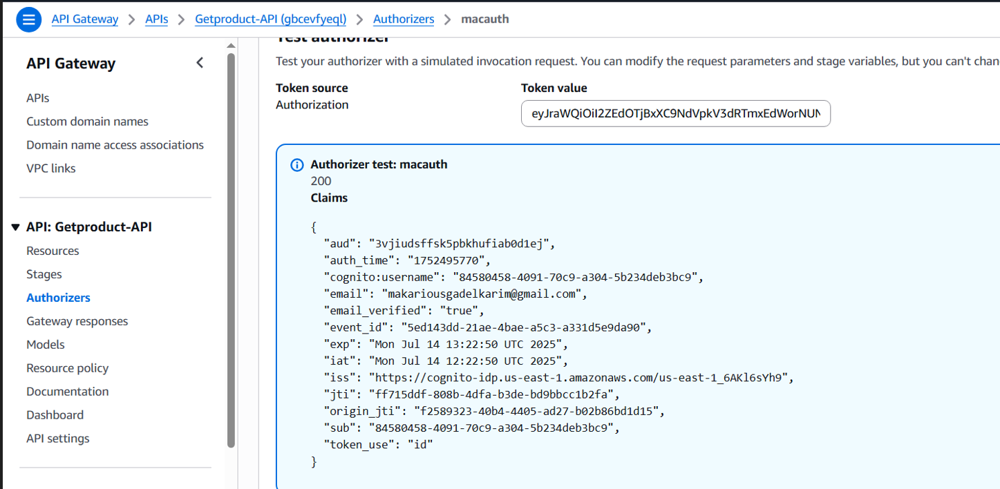

# AWS-SSA-Manara-Graduation-Project

## ***Serverless REST API with DynamoDB and API Gateway***
This project is a serverless web application built using AWS services. It provides a RESTful API to perform CRUD operations on a DynamoDB table, with authentication and security handled via Amazon Cognito, Also enable logging use AWS CloudWatch.

## Table of content
- [Solution Overview](#solution-overview)
- [Features](#features)
- [Architecture Diagram](#architecture-diagram)
- [Setup Steps](#setup-steps)
- [Learning Outcomes](#learning-outcomes)
- [Demo](#demo)

# Solution Overview

1. The user accesses the frontend hosted on **Amazon S3 Static website hosting**, Through CloudFront endpoint for Content Delivery Network.
2. Upon visiting the app, the user is prompted to authenticate using **Amazon Cognito**, SignIn/SignUp.
3. After successful authentication, the user is authenticated by a token and use this token to perform action interacting with APIGateway (check Authorizers for this token) to perform CRUD operations on **DynamoDB** Tasks Table.
4. The API Gateway invoke Lambda Function, and based on headers and data send with the request the function determine which action to do.
5. Lambda Function should have the sufficient permissions of scanning and manipulating data in DynamoDB using IAM Role with the right permissions
6. Security is enforced through **Amazon Cognito (User Pool)** and **IAM roles** assigned to Lambda functions for controlled database access.
7. Observability is ensured via **Amazon CloudWatch**, which logs all API and Lambda activities.
---

# Features
- **Amazon API Gateway** – Exposes secure REST API endpoints.
- **AWS Lambda** – Handles backend logic and CRUD operations.
- **Amazon DynamoDB** – Scalable NoSQL database for product records.
- **Amazon Cognito** – User authentication and token-based authorization.
- **AWS IAM** – Manages access permissions via fine-grained roles.
- **Amazon CloudWatch** – Logs, monitors, and helps with debugging.
- **Amazon S3** – Hosts the static frontend of the application.

# Architecture Diagram

# Setup Steps
- S3 WebHosting:
    - Prepare `index.html` & `error.html`
    - Create a bucket with unique name
    - remove block public access 
    - Attach bucket policy make files public accessed
    - Configure Static Website Hosting

- Setup CloudFront Distributions:
    - Choose the S3 bucket and Path

- Cognito:
    - Create User Pool 
    - chose email for user auth
    - add HTTPS URL(CloudFront-url) return back for CloudFront URL for Login/Logout

- DynamoDB:
    - Create a table called **tasks**

- IAM:
    - create IAM role for lambda function to have access over full access over DB

- Lambda Function:
    - prepare the code to handel each operation 
    - attache **IAM role**
    - test & Deploy

- API Gateway:
    - Specify REST APIs
    - Create each api method GET,POST,DELETE,PUT
    - Enable **CORS**
    - config the authorizer for this apis methods
    - Test & Deploy

# Learning Outcomes:
- Designing scalable, event-driven serverless applications.
- Implementing API Gateway with Lambda for stateless execution.
- Using DynamoDB as a managed NoSQL database with best practices.
- Securing APIs with IAM roles and resource policies.

# Demo

## Hosting Frontend tier app in S3, Config Static website hosting

## Use CDN infant of S3 Static website for better performance & HTTPS access

## Testing CDN access

## Using Cognito for User Authentication

## Cognito UI

## Gateway API

## Test Lambda Role for DynamoDB access

## Test Gateway API Authorizer

## Test Gateway API to forward api to Lambda, then Lambda access DynamoDB

## Testing authenticated/Unauthenticated use of APP/APIs

## REST API Application UI Testing  

