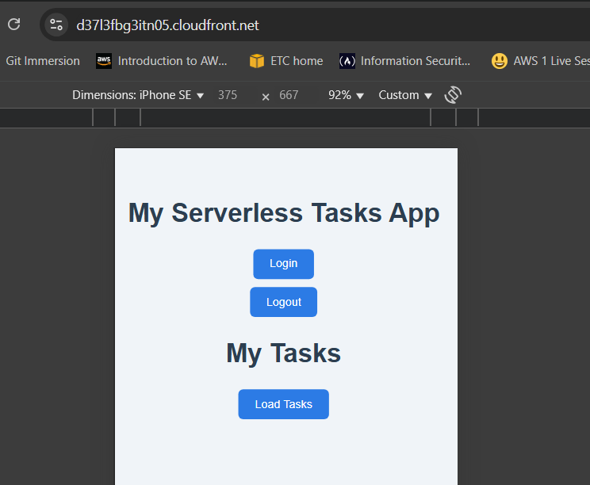

# AWS-SSA-Manara-Graduation-Project

## ***Serverless REST API with DynamoDB and API Gateway***
This project is a serverless web application built using AWS services. It provides a RESTful API to perform CRUD operations on a DynamoDB table, with authentication and security handled via Amazon Cognito, Also enable logging use AWS CloudWatch.

## Table of content
- [Solution Overview](#solution-overview)
- [Architecture Diagram](#architecture-diagram)
- [Architecture](#architecture)
- [Setup Steps](#setup-steps)
- [Demo](#demo)

# Solution Overview

- The user accesses the frontend hosted on **Amazon S3**.
- Upon visiting the app, the user is prompted to authenticate using **Amazon Cognito**.
- After successful authentication, the user is authorized to interact with the REST API to perform CRUD operations on **DynamoDB**.
- Security is enforced through **Amazon Cognito (User Pool)** and **IAM roles** assigned to Lambda functions for controlled database access.
- Observability is ensured via **Amazon CloudWatch**, which logs all API and Lambda activities.
---

## Features
- **Amazon API Gateway** – Exposes secure REST API endpoints.
- **AWS Lambda** – Handles backend logic and CRUD operations.
- **Amazon DynamoDB** – Scalable NoSQL database for product records.
- **Amazon Cognito** – User authentication and token-based authorization.
- **AWS IAM** – Manages access permissions via fine-grained roles.
- **Amazon CloudWatch** – Logs, monitors, and helps with debugging.
- **Amazon S3** – Hosts the static frontend of the application.

# Architecture Diagram

# Architecture

# Setup Steps
- S3 WebHosting:
    - Prepare `index.html` & `error.html`
    - Create a bucket with unique name
    - remove block public access 
    - Attach bucket policy make files public accessed

- Setup CloudFront Distributions:
    - Chose the S3 bucket and Path

- Cognito:
    - Create User Pool 
    - chose email for user auth
    - add HTTPS URL(CloudFront-url) return back for CloudFront URL for Login/Logout

- DynamoDB:
    - Create a table called **tasks**

- IAM:
    - create IAM role for lambda function to have access over full access over DB

- Lambda Function:
    - prepare the code to handel each operation 
    - attache **IAM role**
    - test & Deploy

- API Gateway:
    - Specify REST APIs
    - Create each api method GET,POST,DELETE,PUT
    - Enable **CORS**
    - config the authorizer for this apis methods
    - Test & Deploy

# Demo
## Hosting Frontend tier app in S3, Config Static website hosting

## Use CDN infant of S3 Static website for better performance & HTTPS access

## Testing CDN access

## Using Cognito for User Authentication

## Gateway API

## Test Lambda Role for DynamoDB access

## Test Gateway API Authorizer

## Test Gateway API to forward api to Lambda, then Lambda access DynamoDB

## Testing authenticated/Unauthenticated use of APP/APIs

